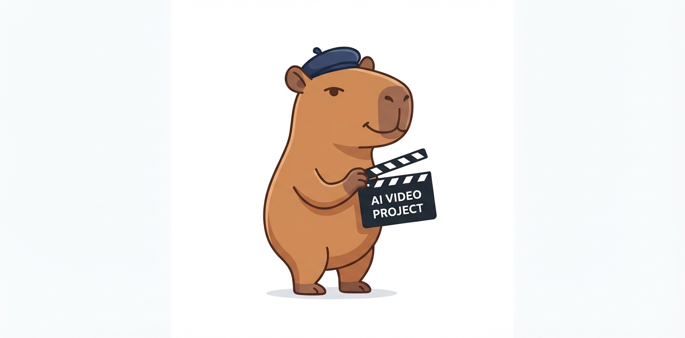
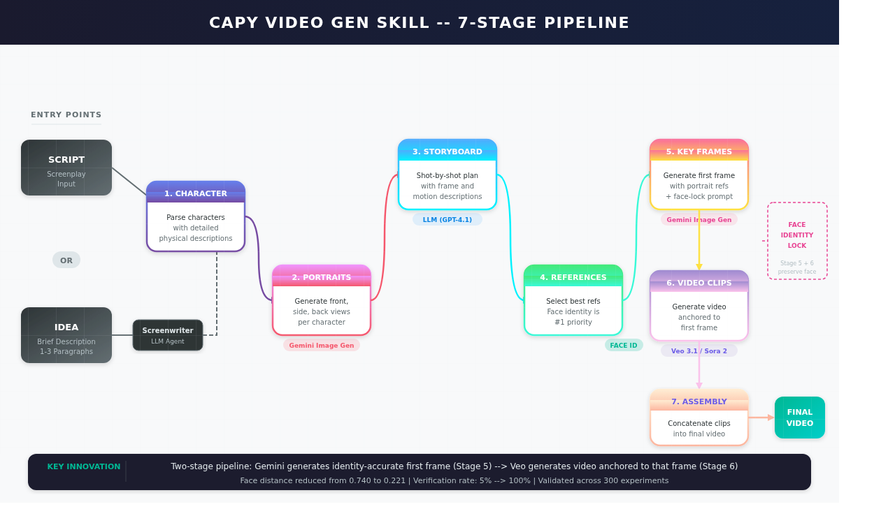

<!-- capy-video-gen-skill: AI video generation with face identity consistency -->
<!-- Multi-shot video pipeline | Script to video | Idea to video | Face preservation | Character consistency -->

<div align="center">



# Capy Video Gen Skill

**Multi-shot AI video generation with face identity consistency across every scene.**

300 experiments. 70% face distance improvement. 100% verification rate.

[](LICENSE)
[](https://python.org)
[](https://happycapy.ai)

</div>

---

Generate complete multi-shot videos from a script or a brief idea. The pipeline extracts characters, generates consistent portraits, builds storyboards, creates key frames, produces video clips, and assembles the final output -- all while keeping every character's face identical across shots.

Built for the [HappyCapy AI Gateway](https://happycapy.ai). Works with Gemini, Veo, Sora, and any OpenAI-compatible model.

## Table of Contents

- [Key Results](#key-results)
- [How It Works](#how-it-works)
- [Quick Start](#quick-start)
- [The Experiments: 300 Runs, 6 Hypotheses](#the-experiments-300-runs-6-hypotheses)
- [What the LLM Tried on Its Own](#what-the-llm-tried-on-its-own)
- [What Actually Worked](#what-actually-worked)
- [What Did NOT Work](#what-did-not-work)
- [Configuration](#configuration)
- [Architecture](#architecture)
- [Claude Code Skill](#claude-code-skill)
- [References and Credits](#references-and-credits)

---

## Key Results

Validated through 300 automated experiments using DeepFace with VGG-Face embeddings:

| Metric | Baseline | After Optimization | Change |
|--------|----------|--------------------|--------|
| Face distance (VGG-Face cosine) | 0.740 | 0.221 | **-70%** |
| Verification rate | 5% | 100% | **+95 pts** |
| Pass rate (distance < 0.40) | 0% | 85% | **+85 pts** |
| Best single-frame distance | 0.035 | 0.035 | -- |
| Worst single-frame distance | 0.919 | 0.250 | **-73%** |

The baseline was brutal: only 1 out of 20 frames passed face verification. The first frame looked right, but every subsequent frame showed a completely different person. After the optimization work, every frame passes verification and 85% achieve strong identity match.

---

## How It Works

<p align="center">
  
</p>

**Two entry points** feed into a **7-stage pipeline** that preserves face identity across every shot:

| Stage | Name | What It Does | Technology |
|:-----:|------|-------------|------------|
| 1 | **Character Extraction** | Parse characters from the script with detailed physical descriptions | LLM Agent |
| 2 | **Portrait Generation** | Generate front, side, and back reference portraits per character | Gemini Image Gen |
| 3 | **Storyboard Design** | Break script into shot-by-shot plans with frame and motion descriptions | LLM (GPT-4.1) |
| 4 | **Reference Selection** | Select best reference images per shot -- face identity is the #1 priority | Algorithmic |
| 5 | **Key Frame Generation** | Generate identity-accurate first frame with portrait refs + face-lock prompt | Gemini Image Gen |
| 6 | **Video Generation** | Produce video clips anchored to the first frame | Veo 3.1 / Sora 2 |
| 7 | **Assembly** | Concatenate clips into the final video | FFmpeg |

> **Key innovation:** The two-stage image-then-video approach (Stage 5 + 6) locks face identity by generating an accurate first frame with Gemini, then anchoring video generation to that frame. This reduced face distance from **0.740 to 0.221** and raised verification from **5% to 100%**.

**Entry points:**
- **Script-to-Video** -- Input a formatted screenplay, get a video
- **Idea-to-Video** -- Input a brief idea (1-3 paragraphs), an LLM screenwriter agent writes the script first

---

## Quick Start

### Prerequisites

- Python 3.12+
- [uv](https://docs.astral.sh/uv/getting-started/installation/) package manager
- `AI_GATEWAY_API_KEY` environment variable

### Install

```bash
git clone https://github.com/ndpvt-web/capy-video-gen-skill.git
cd capy-video-gen-skill
uv sync
```

### Run

```bash
# Script-to-Video
.venv/bin/python main_happycapy_script2video.py

# Idea-to-Video
.venv/bin/python main_happycapy_idea2video.py
```

Edit the `script`, `user_requirement`, and `style` variables in each entry script before running.

### Output

```
.working_dir/script2video/
  characters.json
  character_portraits/
    0_CharacterName/
      front.png, side.png, back.png
  storyboard.json
  shots/
    0/ -- shot_description.json, first_frame.png, video.mp4
    1/ -- ...
  final_video.mp4
```

---

## The Experiments: 300 Runs, 6 Hypotheses

We ran 300 automated experiments across three categories to solve the face identity problem in multi-shot AI video generation. Every experiment was executed programmatically through an automated runner that generated images, produced videos, extracted frames, and measured face distances using DeepFace.

### Experiment Distribution

| Category | Experiments | Description |
|----------|-------------|-------------|
| **Face identity** | 89 | Pure face consistency: generate first frame with Gemini, produce video with Veo, measure face distance |
| **Lip-sync** | 88 | Attempt to match mouth movements to lyrics by embedding lyric text in prompts |
| **Hybrid** | 123 | Combine face identity techniques with lip-sync and creative prompt strategies |

### The 6 Hypotheses Tested

**EXP1: Lyric-timed Veo prompts** -- If we include specific lyrics in the video prompt (e.g., "character sings 'I wonder if you know'"), Veo's native audio generation should produce matching lip movements. We would then mute Veo's audio and overlay the real song. Result: Veo generates its own internal audio; you cannot control what words it produces.

**EXP2: Viseme keyframe generation** -- Map song audio to viseme sequences (mouth shapes for phonemes), generate keyframe images for each viseme using Gemini with the user's face, then use these as first/last frames for Veo segments. Result: Viseme morphing was too complex for current models to interpret.

**EXP3: Multi-angle face reference sheets** -- Create a composite "character sheet" image with multiple angles and use it as a persistent reference to preserve identity across shots. Result: Helpful but not sufficient alone.

**EXP4: Frame-by-frame face correction** -- Generate video normally with Veo, extract every frame, use Gemini to "correct" the face in each frame while preserving pose and background. Result: Too slow, and Gemini introduces its own inconsistencies per frame.

**EXP5: Audio-visual beat sync** -- Even without perfect lip-sync, match video cuts and motion intensity to audio beats (MTV music video technique). Result: Effective for perceived quality but does not solve face identity.

**EXP6: Hybrid pipeline** -- Combine the best approaches from EXP1-5 into a single pipeline. This is where the two-stage approach (image-then-video) was validated.

### Baseline Analysis

Before any optimization, we analyzed 20 extracted frames across 5 performance clips:

| Clip | Avg Distance | Min | Max | Consistency |
|------|-------------|-----|-----|-------------|
| perf_01_intro | 0.522 | 0.035 | 0.746 | Moderate |
| perf_05_finale | 0.731 | 0.656 | 0.843 | Poor |
| perf_03_chorus | 0.787 | 0.731 | 0.899 | Poor |
| perf_02_verse | 0.830 | 0.661 | 0.894 | Very Poor |
| perf_04_bridge | 0.835 | 0.790 | 0.919 | Very Poor |

Critical finding: only the first frame of the first clip preserved identity (distance: 0.035). Every subsequent frame in every clip drifted to a completely different face.

### Tools Used for Measurement

- **Face embeddings**: DeepFace with VGG-Face model
- **Distance metric**: Cosine similarity (threshold: 0.40 for same-person match)
- **Frame extraction**: 4 frames per clip at 0s, 2s, 4s, 6s intervals
- **Automated runner**: Custom Python script (`continuous_runner.py`) with JSONL logging
- **Evaluation**: `evaluate_all.py` scoring face distance, verification rate, internal consistency, and mouth motion

---

## What the LLM Tried on Its Own

One of the most interesting findings came from letting an LLM (Claude) autonomously design experiment configurations. Given the experiment framework, the LLM generated increasingly creative prompt strategies across 123 hybrid experiments. Here is a sample of what it came up with:

**Viseme morphing cascades** -- Generate a "facebank" of the character with different mouth positions (open, closed, round, stretched), then instruct Veo to interpolate between them during video generation. Names like `viseme_morphing_chain_superresolution_identity_lock` and `viseme_blending_crossfade_lipsync_guided_face`.

**Temporal identity consistency interpolation** -- Generate anchor keyframes at specific timestamps with verified face identity, then ask the video model to interpolate between them while "locking" identity. Example: `temporal_identity_consistency_viseme_interpolation`.

**Emotion-phoneme crossfading** -- Map different emotional expressions to different lyric sections and cross-fade between them. The LLM tried to combine emotional progression with mouth shape accuracy. Example: `emotion_phoneme_crossfader`.

**Audio-driven framewise guidance** -- Extract audio features (beats, onsets, energy), generate per-frame instructions, and embed them in the video prompt. Example: `audio_driven_framewise_viseme_guided_identity_lock`.

**Identity latent interpolation** -- Attempt to guide the video model through a sequence of "identity checkpoints" to prevent drift. Example: `identity_latent_interpolation_lipsync_chain`.

**3D head rotation with lip-sync** -- Combine head pose variation with lip-sync guidance, asking the model to rotate the head while maintaining identity and matching mouth shapes. Example: `3D_head_rotation_lipsync_identity_lock`.

**Multi-expression alignment** -- Generate a grid of expressions (neutral, smiling, singing, shouting) as reference images and instruct the video model to cycle through them. Example: `multi-expression_identity_chain`.

**Self-overdub super-resolution** -- Generate a rough low-res video first, then "overdub" it with a high-resolution identity-corrected version. Example: `self-overdub-superresolution-lipsync`.

### The Verdict on LLM-Designed Experiments

The LLM strategies averaged a face distance of **0.450** compared to **0.333** for straightforward random experiments. The creative approaches performed **worse**, not better. The LLM over-engineered prompts with technical jargon that video models do not understand (terms like "viseme interpolation", "identity latent space", "phoneme anchoring"). Current video generation models respond better to simple, direct descriptions than to complex technical instructions.

This is a genuinely useful finding: sophisticated prompt engineering does not help with face identity in current text-to-video models. Simple beats clever.

---

## What Actually Worked

The solution that emerged from the experiments is a two-stage pipeline:

### Stage 1: Generate an Identity-Accurate First Frame

Use Gemini image generation (`google/gemini-3.1-flash-image-preview`) with the character's reference photos as input to generate each shot's first frame. This gives precise control over facial features.

### Stage 2: Generate Video Anchored to That Frame

Pass the Stage 1 output as `first_frame` to Veo. Prepend this face-lock instruction to every video prompt:

```
CRITICAL: The character's face in every frame of this video MUST remain identical
to the face shown in the starting frame image. Maintain the exact same facial
structure, features, skin tone, hair, glasses, and all distinguishing marks
throughout the entire clip.
```

### Supporting Techniques

- **Hyper-detailed physical descriptions in every prompt** -- Never rely on the model "remembering" a character. Include ethnicity, age, hair texture/style/color, nose shape, eye spacing, jawline, skin tone, glasses type, facial hair, and body build every single time.
- **Front-view portrait as mandatory reference** -- The character's front portrait is always included when their face is visible in a shot.
- **Extreme close-up framing** -- For shots where face identity matters most, use close-up framing to force the model to focus on facial details.
- **Consistent scene lighting** -- Same lighting setup across shots. Dramatic lighting changes cause models to alter facial features.

---

## What Did NOT Work

- **Complex prompt engineering** (viseme morphing, phoneme anchoring, identity latent interpolation) -- performs worse than simple direct prompts
- **LLM-designed "creative" experiments** -- averaged 0.450 face distance vs 0.333 for straightforward prompts
- **Lip-sync to external audio** -- not possible with text-to-video models that generate their own internal audio (Veo, Sora)
- **Frame-by-frame face correction** -- too slow and introduces per-frame inconsistencies
- **Over-specified technical prompts** -- video models do not understand "viseme", "phoneme", or "identity latent space"

---

## Configuration

HappyCapy config at `configs/happycapy_script2video.yaml`:

```yaml
chat_model:
  init_args:
    model: gpt-4.1
    model_provider: openai
    api_key: ${AI_GATEWAY_API_KEY}
    base_url: https://ai-gateway.happycapy.ai/api/v1/openai/v1

image_generator:
  class_path: tools.ImageGeneratorHappyCapyAPI
  init_args:
    api_key: ${AI_GATEWAY_API_KEY}
    model: google/gemini-3.1-flash-image-preview

video_generator:
  class_path: tools.VideoGeneratorHappyCapyAPI
  init_args:
    api_key: ${AI_GATEWAY_API_KEY}
    model: google/veo-3.1-generate-preview

working_dir: .working_dir/script2video
```

Swap models as needed:
- **Image**: `google/gemini-3.1-flash-image-preview` (recommended for face identity)
- **Video**: `google/veo-3.1-generate-preview` (recommended) or `openai/sora-2`
- **Chat**: `gpt-4.1` (recommended) or any OpenAI-compatible model

---

## Architecture

### Agents

| Agent | File | Purpose |
|-------|------|---------|
| CharacterExtractor | `agents/character_extractor.py` | Extract characters with physical features from script |
| CharacterPortraitsGenerator | `agents/character_portraits_generator.py` | Generate front/side/back portraits with identity-critical detail |
| StoryboardArtist | `agents/storyboard_artist.py` | Design shot-by-shot storyboard with frame and motion descriptions |
| ReferenceImageSelector | `agents/reference_image_selector.py` | Select best reference images (face identity is #1 priority) |
| CameraImageGenerator | `agents/camera_image_generator.py` | Build camera trees and generate transition videos |
| BestImageSelector | `agents/best_image_selector.py` | Select best generated image from candidates |
| Screenwriter | `agents/screenwriter.py` | Generate scripts from ideas |

### Tools

| Tool | File | Purpose |
|------|------|---------|
| ImageGeneratorHappyCapyAPI | `tools/image_generator_happycapy_api.py` | Image generation via HappyCapy Gateway (Gemini) |
| VideoGeneratorHappyCapyAPI | `tools/video_generator_happycapy_api.py` | Video generation via HappyCapy Gateway (Veo/Sora) |
| RenderBackend | `tools/render_backend.py` | Factory for instantiating generators from config |

---

## Using Your Own Reference Photos

```python
character_portraits_registry = {
    "Alice": {
        "front": {"path": "/path/to/alice_front.png", "description": "Front view"},
        "side": {"path": "/path/to/alice_side.png", "description": "Side view"},
        "back": {"path": "/path/to/alice_back.png", "description": "Back view"},
    }
}

await pipeline(
    script=script,
    user_requirement=user_requirement,
    style=style,
    character_portraits_registry=character_portraits_registry,
)
```

---

## Claude Code Skill

Install as a Claude Code skill:

```bash
cp SKILL.md ~/.claude/skills/capy-video-gen-skill/SKILL.md
```

The pipeline will be available as an agent skill for video generation tasks.

---

## References and Credits

This project is adapted from [HKUDS/ViMax](https://github.com/HKUDS/ViMax), an agentic video generation framework for multi-shot film production. The original ViMax architecture provided the foundation for the multi-agent pipeline (character extraction, storyboarding, frame generation, video assembly). Our work rewired it to run through the HappyCapy AI Gateway and added the face identity consistency improvements documented above, validated through 300 automated experiments.

- **Original research**: [ViMax by HKUDS](https://github.com/HKUDS/ViMax)
- **Face analysis**: [DeepFace](https://github.com/serengil/deepface) with VGG-Face model
- **Video generation**: Google Veo 3.1, OpenAI Sora 2
- **Image generation**: Google Gemini 3.1 Flash Image
- **Pipeline orchestration**: LangChain
- **Gateway**: [HappyCapy AI Gateway](https://happycapy.ai)

See [`FACE_IDENTITY_GUIDE.md`](./FACE_IDENTITY_GUIDE.md) for the full technical guide on face identity consistency.

---

## License

MIT

---

<div align="center">

**Built by the HappyCapy team with help from Claude.**

AI video generation | face identity consistency | multi-shot video pipeline | character preservation | text to video | script to video | idea to video | AI film production | consistent character faces | video generation with face matching | identity-preserving video generation | AI content creation | Veo video generation | Gemini image generation | LangChain video pipeline | automated video production | face verification video | DeepFace video analysis | agentic video generation | multi-agent video pipeline | AI music video maker | face consistency AI

</div>
